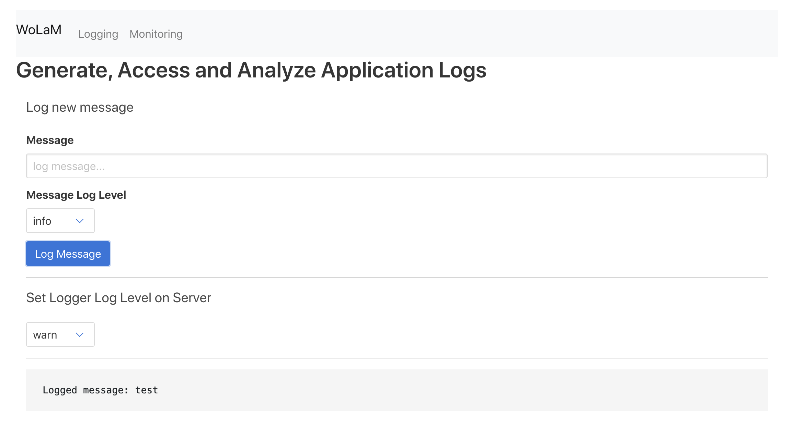

# Generate, Access and Analyze Application Logs
This tutorial shows how the [IBM Cloud Log Analysis](https://console.bluemix.net/catalog/services/log-analysis) service can be used to understand and diagnose activities of an app deployed in the IBM Cloud. We are going to deploy a Python-based Cloud Foundry app, generate different types of logs, and search, analyze and visualize them using Elasticsearch and Kibana, two of the components offered by the IBM Cloud Log Analysis service.e for a tutorial on how to use the IBM Cloud Log Analysis service for accessing, searching and visualizing application logs.

[The tutorials are part of the IBM Cloud documentation](https://console.bluemix.net/docs/tutorials/index.html).

## Objectives
* Provision the IBM Cloud Log Analysis service
* Deploy a Python-based Cloud Foundry app
* Generate different kind of log entries
* Access application logs
* Search and analyze logs
* Visualize logs

## Introduction
IBM Cloud offers three complementary services that help to obtain insights into application health, stability and usage:
* The [IBM Cloud Log Analysis](https://console.bluemix.net/catalog/services/log-analysis) service provides an easy-to-use interface to logs generated by applications running in the IBM Cloud. In the premium plans, even external log events can be fed into the service for consolidated storage and analysis.
* The [Availability Monitoring](https://console.bluemix.net/catalog/services/availability-monitoring) service can be used to perform regular tests on an application to check availability, including speed.
* Last, the [IBM Cloud Activity Tracker](https://console.bluemix.net/catalog/services/activity-tracker) has the capability to capture, store and visualize activities performed by IBM Cloud users and services in your account. Captured events can be stored and analyzed, e.g., to investigate security breaches or unauthorized access.

In this tutorial, we are going to take a look at how to generate, access and analyze application logs. The [documentation for IBM Cloud Log Analysis](https://console.bluemix.net/docs/services/CloudLogAnalysis/index.html) already includes a [tutorial on how to analyze logs for an app deployed in a Kubernetes cluster](https://console.bluemix.net/docs/services/CloudLogAnalysis/containers/tutorials/kibana_tutorial_1.html). Therefore, in this guide, we are going to use a Cloud Foundry app.

Here is a screenshot of the app in this repository. Read the full guide at the [IBM Cloud tutorials](https://console.bluemix.net/docs/tutorials/index.html) page: https://console.bluemix.net/docs/tutorials/application-log-analysis.html   
   

## Related Content
* [Documentation for IBM Cloud Log Analysis](https://console.bluemix.net/docs/services/CloudLogAnalysis/index.html)
* [Logging facility for Python](https://docs.python.org/3/library/logging.html)
* [IBM Cloud Log Collection API](https://console.bluemix.net/apidocs/948-ibm-cloud-log-collection-api?&language=node#introduction)
* Kibana User Guide: [Discovering Your Data](https://www.elastic.co/guide/en/kibana/5.1/tutorial-discovering.html)
* Kibana User Guide: [Visualizing Your Data](https://www.elastic.co/guide/en/kibana/5.1/tutorial-visualizing.html)
* Kibana User Guide: [Putting it all Together with Dashboards](https://www.elastic.co/guide/en/kibana/5.1/tutorial-dashboard.html)
